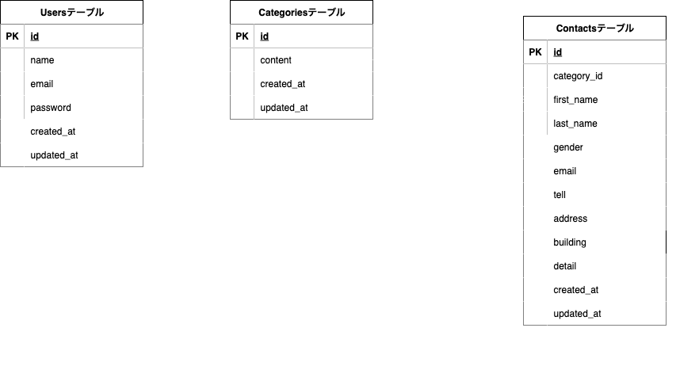

# お問い合わせフォーム

## 前提条件

開発環境を構築する前に、以下がインストールされていることを確認してください：

-   Docker Desktop (最新版推奨)
-   Git
-   テキストエディタ（VS Code 推奨）

## 環境構築

### 1. プロジェクトのクローン

git clone [リポジトリの URL]
cd test1

### 2. Docker 環境の構築

docker-compose up -d --build

**※ 注意事項**

-   MySQL は OS によって起動しない場合があります
-   Windows の場合は `docker-compose.yml` の volumes 設定を調整が必要な場合があります
-   M1/M2 Mac の場合は `platform: linux/x86_64` を mysql サービスに追加してください

### 3. Laravel 環境の構築

PHP コンテナに入ります：

docker-compose exec php bash

コンテナ内で以下のコマンドを実行：

# 依存関係のインストール

composer install

# 環境設定ファイルの作成

cp .env.example .env

# アプリケーションキーの生成

php artisan key:generate

# データベースマイグレーション

php artisan migrate

# 初期データの投入

php artisan db:seed

### 4. .env ファイルの設定

`.env` ファイルを以下のように設定してください：

APP_NAME=ContactForm
APP_ENV=local
APP_KEY=（php artisan key:generate で自動生成）
APP_DEBUG=true
APP_URL=http://localhost

DB_CONNECTION=mysql
DB_HOST=mysql
DB_PORT=3306
DB_DATABASE=laravel_db
DB_USERNAME=laravel_user
DB_PASSWORD=laravel_pass

## 使用技術

-   PHP 8.1
-   Laravel 8.x
-   MySQL 8.0.26

## ER 図

## アクセス情報

### アプリケーション

-   **開発環境**: http://localhost/
-   **phpMyAdmin**: http://localhost:8080/

### 管理者ログイン

管理者アカウントでログインする場合：

メールアドレス: admin@example.com
パスワード: password
